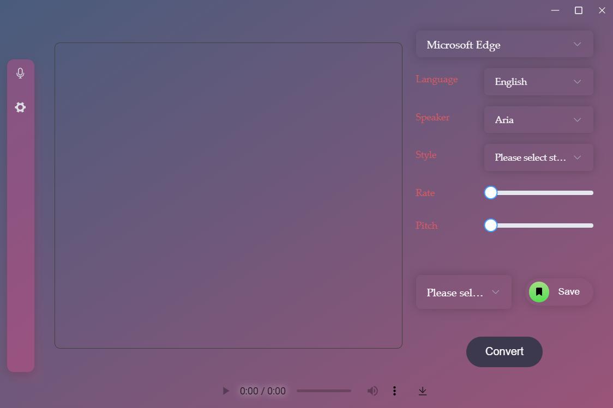
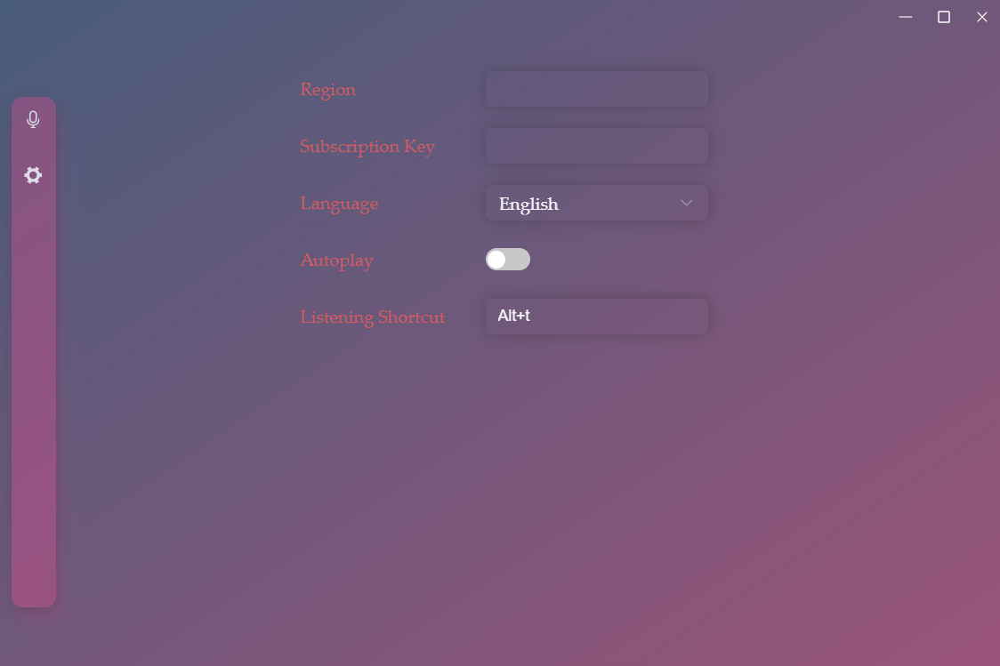

<h3 align="center">Praises</h3>

  

    Praises is a text-to-speech tool that can help you read text easily.
     
     
    English
    ·
    <a href="https://github.com/ElmTran/praises/blob/master/README.zh-CN.md">简体中文</a>
    ·
    <a href="https://github.com/ElmTran/praises/issues/new?labels=bug&template=bug-report---.md">Report Bug</a>
    ·
    <a href="https://github.com/ElmTran/praises/issues/new?labels=enhancement&template=feature-request---.md">Request Feature</a>
  

## Download

You can download the latest version from the [release page](https://github.com/ElmTran/praises/releases).

## Usage

### Home Page

- API Selection: select the API to convert text to speech. Edge, Azure(requires subscription key and region) and TikTok are supported.

- Text Input: input the text to convert to speech.

- Language: select the language of the text.

- Speaker: select the speaker of the speech.

- Style: select the style of the speech.

- Rate: preset the speed of the speech.

- Pitch: preset the pitch of the speech.

- Template: the template of the preset(only available when using Azure API and Edge API). Allow you to create your own preset. Use Save to save the preset.

- Convert: convert the text to speech. If Autoplay is enabled, the speech will be played automatically.

### Setting Page

- Region: the region of the Azure API.

- Subscription Key: the subscription key of the Azure API.

- Language: the language of application.

- Autoplay: whether to autoplay the speech when converting text to speech.

- Listening Shortcut: the shortcut key to listen the selected text.

### Notice

- When using Microsoft Edge as the API, not all voices are supported. Supported voices will be separated later.

- Azure API requires subscription key and region. You can get help from [here](https://learn.microsoft.com/en-us/azure/ai-services/speech-service/get-started-text-to-speech?tabs=windows%2Cterminal&pivots=programming-language-csharp#prerequisites).

## Roadmap

- [x] Azure API

- [x] Edge API

- [x] i18n

- [ ] ~~ChatTTS API~~

- [x] GitHub Actions

- [x] System Tray

- [x] Selection Speech Shortcut

- [x] TikTok API

- [ ] Support Speech Synthesis Markup Language (SSML)

## License

Distributed under the MIT License. See `LICENSE` for more information.

[![License][license-shield]][license-url]

## Contact

Mengqing - [@Telegram](https://t.me/mzfbwu/) - [@Email](mailto:c897611977@gmail.com)

## Credits

- [tts-vue](https://github.com/LokerL/tts-vue)

## Acknowledgments

- [Vue 3](https://vuejs.org/)

- [UnoCSS](https://unocss.dev/)

- [Pinia](https://pinia.vuejs.org/)

- [Element Plus](https://element-plus.org/en-US/)

- [Tauri](https://tauri.app/)

- [Azure Cognitiveservices Speech](https://learn.microsoft.com/en-us/azure/ai-services/speech-service/get-started-text-to-speech?tabs=windows%2Cterminal&pivots=programming-language-rest#synthesize-to-a-file)

<!-- MARKDOWN LINKS & IMAGES -->
<!-- https://www.markdownguide.org/basic-syntax/#reference-style-links -->

[license-shield]: https://img.shields.io/github/license/ElmTran/praises
[license-url]: https://github.com/ElmTran/praises/blob/master/LICENSE
