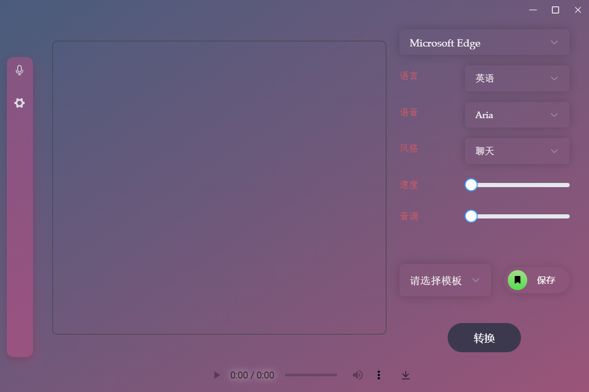
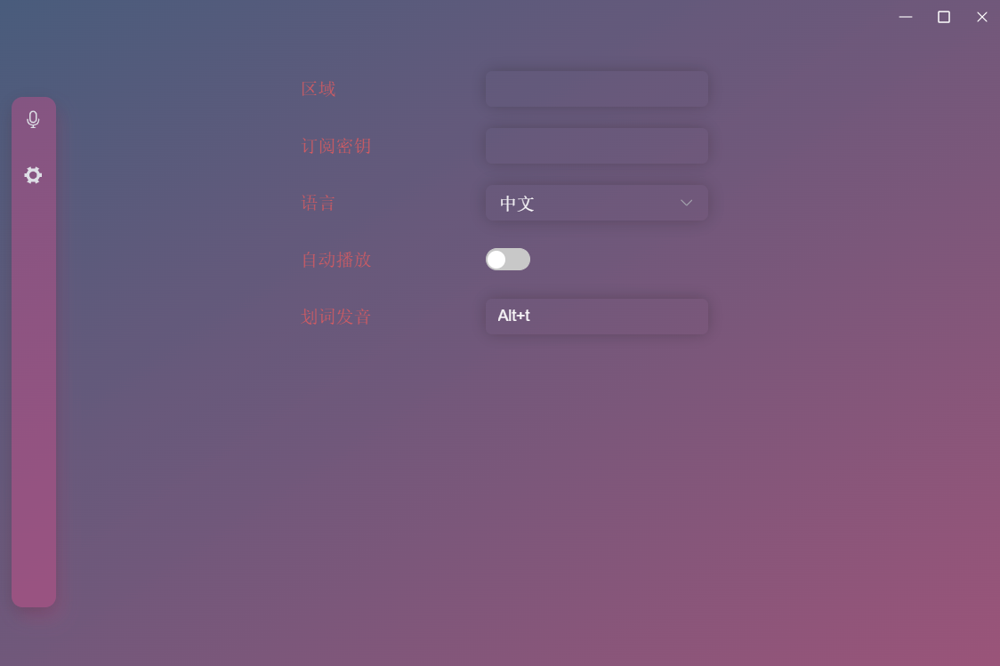

<h3 align="center">Praises</h3>

  

    Praises 是一个文字转语音工具，可以帮助您轻松阅读文本。
     
     
    <a href="https://github.com/ElmTran/praises/blob/master/README.md">English</a>
    ·
    简体中文
    ·
    <a href="https://github.com/ElmTran/praises/issues/new?labels=bug&template=bug-report---.md">报告Bug</a>
    ·
    <a href="https://github.com/ElmTran/praises/issues/new?labels=enhancement&template=feature-request---.md">提出建议</a>
  

## 下载

您可以从[发布页面](https://github.com/ElmTran/praises/releases)下载最新版本。

## 使用方法

### 主页

- API 选择：选择用于将文本转换为语音的 API。支持 Edge、Azure（需要订阅密钥和区域）和 TikTok接口。

- 文本输入：输入要转换为语音的文本。

- 语言选择：选择文本的语言。

- 语音选择：选择语音的说话人。

- 风格预设：选择语音的风格预设。

- 语速：语音的速度。

- 音调：语音的音调。

- 模板：预设的模板（仅在使用 Azure API 和 Edge API 时可用）。允许您创建自己的预设。输入模板名称，然后点击保存。

- 转换：将文本转换为语音。如果启用了自动播放，语音将自动播放。

### 设置页面

- 区域：Azure API 的区域。

- 订阅密钥：Azure API 的订阅密钥。

- 语言：交互的语言。

- 自动播放：将文本转换为语音时是否自动播放语音。

- 划词发音：划词发音的快捷键设置。

### 注意事项

- 选择 Microsoft Edge 作为 API 时，由于是试用接口，不支持所有的语音。后续会分离出 Edge 支持的语音。

- 选择 Azure 作为 API 时，需要订阅密钥和区域。你可以从 [Azure AI 服务](https://learn.microsoft.com/en-us/azure/ai-services/speech-service/get-started-text-to-speech?tabs=windows%2Cterminal&pivots=programming-language-csharp#prerequisites) 获得帮助。

## 路线图

- [x] Azure API

- [x] Edge API

- [x] 国际化

- [ ] ~~ChatTTS API~~

- [x] GitHub Actions

- [x] 系统托盘

- [x] 选择文本语音快捷键

- [x] TikTok API

- [ ] 支持语音合成标记语言（SSML）

## 许可证

根据 MIT 许可证分发。有关更多信息，请参阅 `LICENSE`。

[![许可证][license-shield]][license-url]

## 联系方式

Mengqing - [@Telegram](https://t.me/mzfbwu/) - [@Email](mailto:c897611977@gmail.com)

## 致谢

- [tts-vue](https://github.com/LokerL/tts-vue)

## 引用

- [Vue 3](https://vuejs.org/)

- [UnoCSS](https://unocss.dev/)

- [Pinia](https://pinia.vuejs.org/)

- [Element Plus](https://element-plus.org/en-US/)

- [Tauri](https://tauri.app/)

- [Azure Cognitiveservices Speech](https://learn.microsoft.com/en-us/azure/ai-services/speech-service/get-started-text-to-speech?tabs=windows%2Cterminal&pivots=programming-language-rest#synthesize-to-a-file)

<!-- MARKDOWN LINKS & IMAGES -->
<!-- https://www.markdownguide.org/basic-syntax/#reference-style-links -->

[license-shield]: https://img.shields.io/github/license/ElmTran/praises
[license-url]: https://github.com/ElmTran/praises/blob/master/LICENSE
